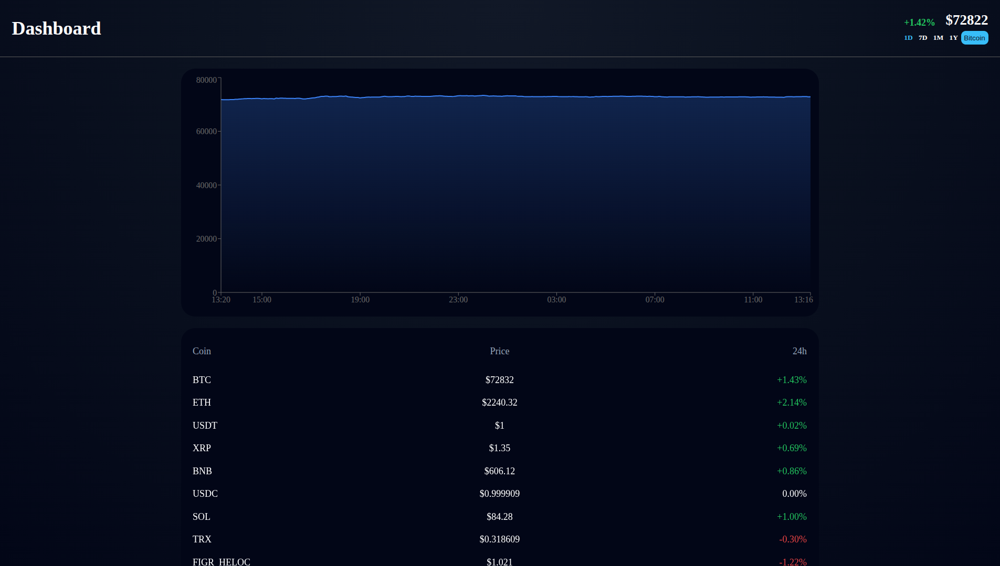

# 📊 Crypto Dashboard

A modern real-time cryptocurrency dashboard built with React, TypeScript, React Query and Recharts.  
The project focuses on clean architecture, scalable data flow, and high-performance UI rendering.

---

## 🌍 Languages
- 🇺🇸 English (current)
- 🇷🇺 [Русский](./README.ru.md)

---

## 📸 Preview


---

## 🌍 Live Demo
👉 https://zirolio.github.io/CryptoDashboard/

---

## ✨ Features

- 📈 Real-time crypto price tracking  
- 📊 Interactive charts (Recharts)  
- 🪙 Coin selection system  
- ⏱ Timeframe switching (1D / 7D / 1M etc.)  
- 🔄 Cached API data with React Query  
- ⚡ Fast and optimized rendering  
- 📉 Price change indicators  
- 💾 Local UI state persistence  
- 🧩 Modular architecture (FSD-inspired)  

---

## 🏗 Architecture

The project follows a **Feature-Sliced Design (FSD)-like architecture**:

```

src/
├── app/        # app bootstrap, config, global styles
├── pages/      # application pages (Dashboard)
├── widgets/    # UI blocks (Chart, Table, Sidebar)
├── entities/   # business entities (coins)
├── shared/     # reusable logic
│    ├── api/   # API layer
│    ├── ui/    # UI components
│    ├── hooks/ # custom hooks
│    ├── util/  # helpers
│    └── domain/# data adapters
├── store/      # Redux state management

````

---

## 🧠 Data Flow

- API requests handled via `shared/api` (Axios)
- Data caching and synchronization via **React Query**
- Domain transformation via `adapters` (clean separation)
- UI consumes normalized data from entities layer

---

## 🛠 Tech Stack

- ⚛️ React 19  
- 🟦 TypeScript  
- ⚡ Vite  
- 🔄 React Query  
- 🧠 Redux Toolkit  
- 📊 Recharts  
- 🌐 Axios  
- 🎨 SCSS Modules  
- 🧩 Classix  

---

## 🚀 Getting Started

```bash
git clone https://github.com/Zirolio/CryptoDashboard.git
cd cryptodashboard
npm install
npm run dev
````

---

## 📦 Build

```bash
npm run build
```

---

## 🌍 Deployment

```bash
npm run deploy
```

---

## 📁 Project Highlights

* 🧠 Clean separation of data / UI / domain layers
* ⚡ Optimized API handling with caching
* 📊 Smooth chart rendering
* 🧩 Scalable FSD-inspired structure
* 🔥 Production-ready architecture

---

## 🔮 Future Improvements

* 🌙 Dark/light theme toggle
* 📱 Mobile UX improvements

---

## 📄 License

MIT